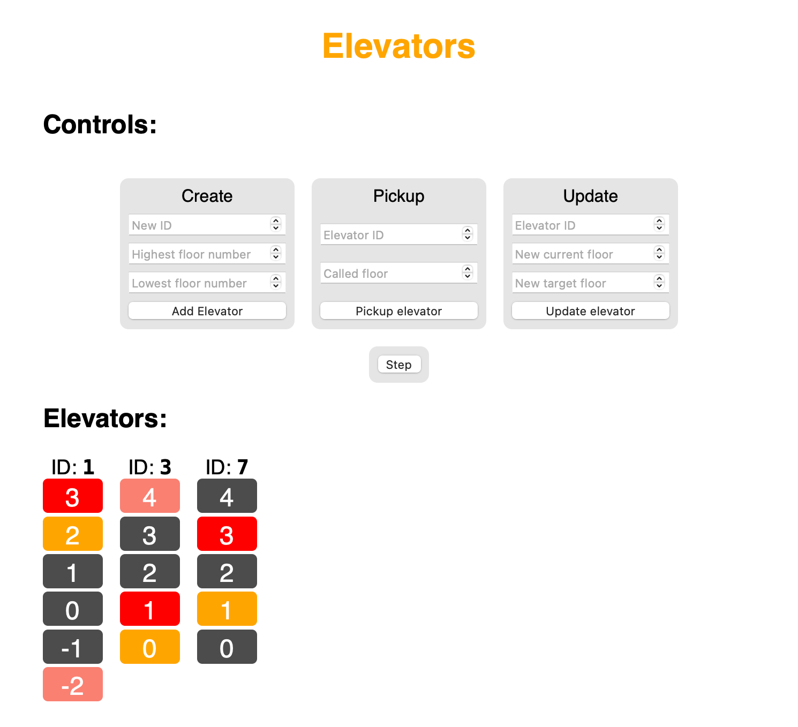

# Elevators

This web app is designed to represent a system of elevators. It provides an easy way of interacting with the simulated elevators themselves.



## Quickstart

### Online

The app is available to use for everyone online [here](https://elevators-wojexe.vercel.app).

### Locally

```sh
# Clone the repository
git clone https://github.com/wojexe/elevators
cd elevators

# Install dependencies
npm i

# Build and preview the release version
npm run build
npm run preview

# Start the developement server
npm run dev

# Run the tests
npm run test:unit
```

## Controls

### Meaning of colors


### Create

Creates a new elevator with the provided `ID`, which moves in the range between the highest and lowest floor numbers (inclusive range).

### Pickup

Requests an elevator with the provided `ID` to arrive at the specified floor. The algorithm which handles the ordering of requested pickups is described in the [algorithm section](#algorithm).

### Update

Teleports the elevator with the provided `ID` to the *new current floor* and sets the *new target floor* as the next floor to be visited. Calling update **does not** change the ordering of the already existing queue.

## Algorithm

The logic behind queueing requests works as follows:

- Reject the request if it's outside of the range handled by the elevator
- Ignore the request if the floor is already in the queue
- If the queue is empty - add the floor to the queue and stop
- Otherwise, perform the following operations in a loop:
  - Let `prevTarget` be equal to the current floor and `nextTarget` be equal to the first element of the queue (we can assume, that the queue is ordered according to the algorithm)
  - If the requested floor is between `prevTarget` and `nextTarget` insert it between these elements in the queue
- If the requested floor could not be fitted between two already requested floors from the queue - push it to the end of the queue
